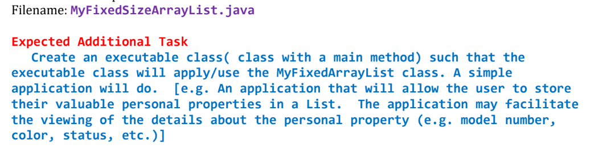
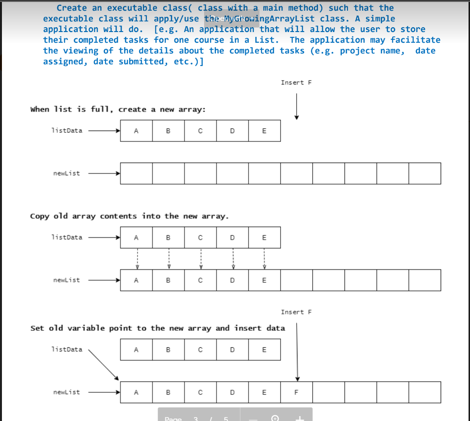
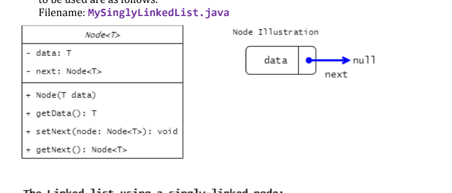
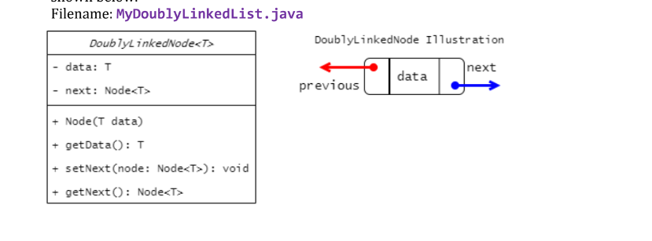
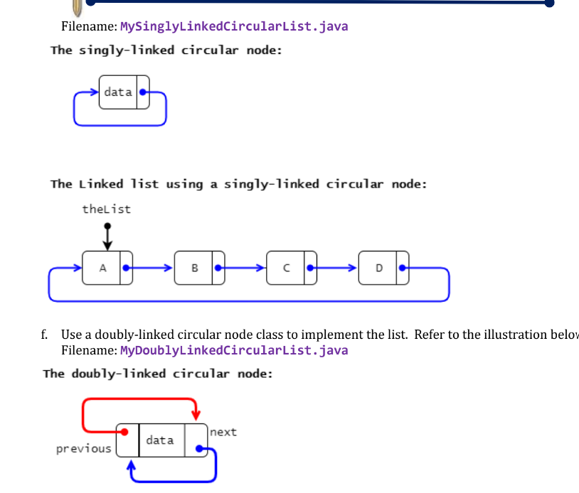
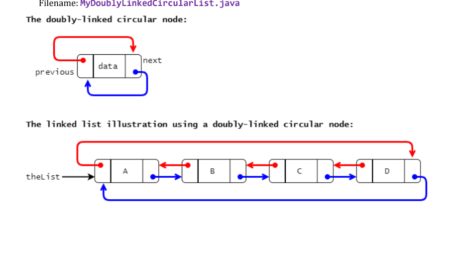

## Data Structures Implementations in JAVA
A java project to implement the data structures mainly the different types of linked list

## User Manual
#### Starting the application
* The user must go to the package prelim and inside prelim, go to Tester_Classes where the runnable classes are located
* There is also a Reference_Classes package where the reference classes are located
* For more information about the project, you can go to the Documentation package and click README.md

#### A brief overview:
* a. Use an array object to store the elements of the list object. This array object will have a fixed size of
  five (5) and that an attempt to insert
* (
* Use an array object to store the elements of the list object. Although the initial size of the array is 5,
  this differs from the first situation because if the array is full and an element is to be inserted, a new
  array object with a size that is twice than the “old” array will be created. All the elements of the “old”
* 
* Use a singly-linked node class to implement the linked list implementation. Details of the Node class
  to be used are as follows.
* 
* Use a doubly-linked node class to implement the list. Details of the DoublyLinkedNode class are
  shown below.
* 
* Use a singly-linked circular node class to implement the list. Refer to the illustration below.
* 
* Use a doubly-linked circular node class to implement the list. Refer to the illustration below.
* 

